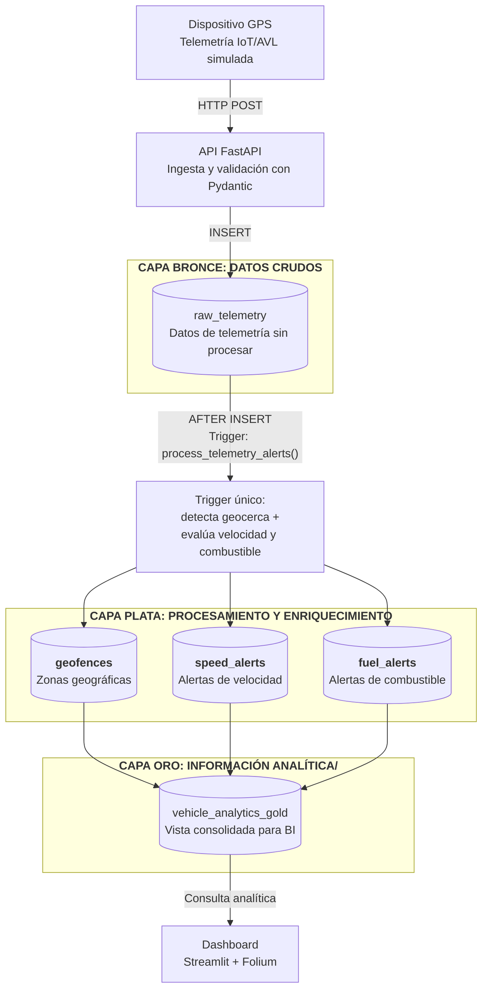

# **Sistema de Telemetría GIS - Simón Movilidad**

## 1. Objetivo del sistema

Proporcionar información en tiempo real sobre el comportamiento y las condiciones operativas asociadas a la movilidad, mediante el análisis de datos de telemetría y ubicación, para apoyar la gestión de la seguridad, el desempeño y la eficiencia operacional.

## 2. Arquitectura general del pipeline

La solución se estructuró bajo una arquitectura de datos de tres capas (Bronce, Plata y Oro), donde cada nivel tiene una responsabilidad específica dentro del flujo de procesamiento. La arquitectura permite mantener los datos originales, separar la lógica de procesamiento espacial y exponer una estructura optimizada para análisis y visualización.


### 2.1. Principio de separación de las capas

La arquitectura propuesta permite separar los datos de acuerdo con su nivel de procesamiento y propósito, de este modo, la capa **BRONCE** permite almacenar la telemetría original sin modificaciones; la capa **PLATA** se encarga de procesar y enriquecer los datos por medio de lógica espcial y de negocio definida; y, la capa **ORO** permite consolidar la información procesada para su consumo por BI.

## 3. Decisiones de infraestructura

### 3.1 PostgreSQL + PostGIS

Se seleccionó **PostgreSQL + PostGIS** por dos diferencias técnicas concretas frente a SQLite. Primero, SQLite no tiene un sistema de roles y permisos a nivel de motor (es una base de datos embebida, de archivo único, sin modelo de usuarios): el enmascaramiento de `vehicle_id` mediante `GRANT`/`REVOKE` sobre una vista, implementado en este proyecto, no tiene equivalente en SQLite y habría requerido resolverse en la capa de aplicación. Segundo, los triggers de SQLite están limitados a sentencias SQL simples dentro del bloque `BEGIN...END`, sin soporte de variables declaradas ni bloques `DECLARE` como PL/pgSQL; el trigger de este proyecto declara una variable (`autonomy_km`) y encadena dos evaluaciones condicionales sobre ella, lo cual sí es directo en PL/pgSQL.

**Trade-off:** SQLite + SpatiaLite evita levantar un proceso de base de datos independiente, pero traslada el control de acceso a la capa de aplicación y obliga a simplificar la lógica del trigger, perdiendo la garantía de que el enmascaramiento se aplique sin importar qué cliente consulte los datos.

### 3.2 Docker

**Docker Compose** fija la versión del motor (PostgreSQL 16) y de la extensión espacial (PostGIS 3.4) en `docker-compose.yml`, eliminando dependencia de lo instalado en el host.

La inicialización del esquema completo (extensión PostGIS, tablas, vistas, roles, geocercas y trigger) está automatizada mediante scripts SQL numerados en `db/init/`, montados en `/docker-entrypoint-initdb.d/` del contenedor. Esto corresponde a la convención de la imagen oficial de PostgreSQL que ejecuta en orden alfabético cualquier `.sql` encontrado ahí en el primer arranque. Un solo `docker compose up -d` deja la base de datos completamente lista, sin pasos manuales adicionales.

Como elemento destacable del proceso, se debe mencionar que una instalación nativa de PostgreSQL 17 en el sistema operativo ocupaba el puerto 5432 estándar; los clientes de base de datos se conectaban silenciosamente a ese motor nativo en lugar del contenedor, generando errores de autenticación sin registro en los logs de Docker. Se resolvió remapeando el contenedor al puerto externo 5433 (`"5433:5432"`), documentado en `SETUP.md`.

### 3.3 Gestión de credenciales

Las credenciales y parámetros de conexión se gestionan mediante **variables de entorno** en `.env`, excluido del repositorio vía `.gitignore`. Un `.env.example` documenta las variables requeridas sin exponer valores reales.

## 4. CAPA BRONCE: Ingesta y persistencia

### 4.1 Esquema de `raw_telemetry`

En la propuesta se utilizó `BIGSERIAL` como clave primaria por su generación secuencial y menor tamaño frente a un `UUID`, lo que favorece las inserciones en una tabla de alta frecuencia de escritura. Por otro lado, `reported_at` representa el momento en que el vehículo generó el registro, y `created_at` corresponde al momento de persistencia; esta distinción permite identificar posibles variaciones entre la generación y la ingesta telemétrica. El campo `reported_at` se recibe como parte opcional del payload de ingesta (`TelemetryPacket`); si el cliente no lo envía, el servidor usa `COALESCE(%s, NOW())` para asignar el momento de recepción como valor por defecto, preservando la distinción entre ambas marcas de tiempo incluso cuando el dispositivo no reporta su propio reloj.

Ahora bien, los `CHECK` garantizar los rangos esperados para **velocidad** (definido para efectos de la propuesta entre 0 y 300 km/h) y **combustible** (propuesto en términos porcentuales), `ST_IsValid` valida la **geometría** (tipo punto), lo que permite complementar la validación realizada en la API. Finalmente, el índice `GiST` permite optimizar las consultas espaciales sobre `geom`, mientras que el índice compuesto por `vehicle_id` y `reported_at` logra soportar consultas temporales por cada vehículo.

```sql
CREATE TABLE raw_telemetry (
    id BIGSERIAL PRIMARY KEY,
    vehicle_id VARCHAR(20) NOT NULL,
    reported_at TIMESTAMPTZ NOT NULL,
    speed_kmh NUMERIC(5,2) NOT NULL CHECK (speed_kmh >= 0 AND speed_kmh <= 300),
    fuel_level NUMERIC(5,2) NOT NULL CHECK (fuel_level BETWEEN 0 AND 100),
    geom GEOMETRY(Point, 4326) NOT NULL,
    created_at TIMESTAMPTZ NOT NULL DEFAULT NOW(),
    CONSTRAINT chk_valid_geom CHECK (ST_IsValid(geom))
);

CREATE INDEX idx_raw_telemetry_geom ON raw_telemetry USING GIST (geom);
CREATE INDEX idx_raw_telemetry_vehicle_time ON raw_telemetry (vehicle_id, reported_at DESC);
```

### 4.2 API de ingesta y validación en dos capas

Se implementó un endpoint HTTP (`POST /telemetry`) como punto de entrada de la telemetría. En lugar de permitir inserciones directas desde los dispositivos, la API recibe los datos, valida la estructura y los rangos, y gestiona su persistencia en PostgreSQL. En este orden de ideas, la siguiente tabla muestra los endpoints expuestos:

| Método | Ruta | Función |
|---|---|---|
| `POST` | `/telemetry` | Recibe un paquete de telemetría, lo valida, lo inserta y devuelve el estado de alertas generadas por el trigger |
| `GET` | `/health` | Verificación de disponibilidad del servicio |

De este modo, se definió el **modelo de entrada** (`schemas.py`, mediante Pydantic), descrito como:

```python
class TelemetryPacket(BaseModel):
    vehicle_id: str = Field(..., min_length=3, max_length=20)
    latitude: float = Field(..., ge=-90, le=90)
    longitude: float = Field(..., ge=-180, le=180)
    speed_kmh: float = Field(..., ge=0, le=300)
    fuel_level: float = Field(..., ge=0, le=100)
```

Ahora bien, la **respuesta de la API** permite confirmar la persistencia del registro e incluye las alertas generadas durante el procesamiento. Estas se consultan inmediatamente después de la inserción, aprovechando que el trigger se ejecuta dentro de la misma transacción.

```json
{
  "status": "ok",
  "id": 145,
  "alerts": {
    "speed_alert": true,
    "speed_excess_kmh": 12.4,
    "fuel_alert": false,
    "estimated_autonomy_km": null
  }
}
```

Es necesario precisar que la validación se realiza en dos niveles. Primero, **Pydantic** valida la estructura y los rangos antes de ejecutar operaciones sobre la base de datos. Segundo, las **restricciones** `CHECK` de PostgreSQL mantienen la integridad de los datos independientemente del cliente que realice la inserción.

### 4.3 Pool de conexiones

Se utiliza `psycopg2.pool.SimpleConnectionPool` con un rango de **1 a 10 conexiones** para reutilizar conexiones de PostgreSQL entre las solicitudes de la API, evitando establecer una nueva conexión por cada petición. El pool permite limitar el número de conexiones simultáneas generadas por la aplicación y controlar el consumo de recursos del servidor de base de datos.

Se eligió `SimpleConnectionPool` porque la API se ejecuta en un único proceso y no requiere coordinación del pool entre múltiples procesos. Si el servicio se desplegara con múltiples workers, sería necesario evaluar un pool por proceso o un mecanismo de pooling externo.

**Bug detectado y corregido:** una implementación inicial liberaba la conexión con `conn.close()` en vez de `release_connection(conn)`, cerrándola a nivel de socket sin devolverla al pool. El pool la seguía contando como en uso, agotando las 10 conexiones disponibles tras la décima petición (`PoolError: connection pool exhausted`).

### 4.4 Enmascaramiento de privacidad

Los usuarios con rol de solo lectura acceden al `vehicle_id` mediante una vista que reemplaza parte del identificador original por `****`, mientras que el acceso directo a `raw_telemetry` queda restringido.

```sql
CREATE VIEW telemetry_masked AS
SELECT id,
    CASE WHEN LENGTH(vehicle_id) >= 8
         THEN LEFT(vehicle_id, 4) || '****' || RIGHT(vehicle_id, 4)
         ELSE vehicle_id END AS vehicle_id,
    reported_at, speed_kmh, fuel_level, geom, created_at
FROM raw_telemetry;

CREATE ROLE gis_admin WITH LOGIN PASSWORD '...';
GRANT SELECT, INSERT, UPDATE ON raw_telemetry TO gis_admin;

CREATE ROLE gis_readonly WITH LOGIN PASSWORD '...';
GRANT SELECT ON telemetry_masked TO gis_readonly;
```
El enmascaramiento se implementa en la capa de base de datos mediante **vistas** y **roles**, separando el acceso a los datos originales de su exposición. El rol `gis_readonly` únicamente puede consultar `telemetry_masked`, mientras que `gis_admin` mantiene acceso a `raw_telemetry`. Se validó que `gis_readonly` no puede consultar directamente `raw_telemetry`, recibiendo un error de permisos al intentar acceder a la tabla.

**Nota de seguridad:** las contraseñas de los roles `gis_admin` y `gis_readonly` están escritas en texto plano en los scripts de inicialización, con valores simples (`admin_pass123`, `readonly_pass123`). Esto es aceptable en este contexto porque el contenedor es exclusivamente local, sin exposición a internet, y cualquiera que despliegue el proyecto crea su propia instancia aislada. No se gestionan vía `.env` porque PostgreSQL no interpola variables de entorno dentro de archivos `.sql` ejecutados por `docker-entrypoint-initdb.d`; en un entorno de producción real, esto se resolvería con una plantilla procesada (`envsubst`) o un gestor de secretos.

### 4.5 Simulación de flota y generación de rutas

Se implementó un simulador de telemetría que genera recorridos sobre rutas geográficas realistas dentro de Cali. Las rutas principales se obtienen mediante **OSRM (Open Source Routing Machine)**, utilizando la geometría GeoJSON retornada por el servicio para obtener los puntos que siguen el trazado de la red vial. A continuación, se presenta la implementación de esta lógica de negocio por simulación:

```python
def generate_route_osrm(origin, destination, timeout=5):
    lat1, lon1 = origin
    lat2, lon2 = destination
    url = f"{OSRM_BASE_URL}/{lon1},{lat1};{lon2},{lat2}"
    params = {"overview": "full", "geometries": "geojson"}

    try:
        response = requests.get(url, params=params, timeout=timeout)
        response.raise_for_status()
        data = response.json()
        if data.get("code") != "Ok":
            return None
        coords = data["routes"][0]["geometry"]["coordinates"]
        return [(lat, lon) for lon, lat in coords]
    except (requests.RequestException, KeyError, IndexError):
        return None
```

Debido a que OSRM constituye una dependencia externa, se implementó un fallback de interpolación lineal entre el origen y el destino. Este mecanismo permite continuar la generación de datos ante errores de conexión, respuestas inválidas o expiración del `timeout`.

```python
def generate_route(origin, destination, num_points=20):
    route = generate_route_osrm(origin, destination)
    if route is not None:
        return {"route": route, "route_source": "osrm"}
    route = generate_route_fallback(origin, destination, num_points)
    return {"route": route, "route_source": "interpolated_fallback"}
```

El atributo `route_source` identifica el mecanismo utilizado para generar cada recorrido, permitiendo distinguir entre rutas obtenidas de la red vial y rutas generadas mediante el mecanismo de contingencia.

## 5. CAPA PLATA: Enriquecimiento espacial y alertas

### 5.1 Definición de geocercas

Se definió Cali como escenario piloto de la prueba, usando sus coordenadas reales como marco de referencia geográfico. Se intentaron tres fuentes de datos abiertos oficiales para obtener los polígonos reales de las comunas: Overpass API (falló por rate-limiting del servicio público), el WFS de la Alcaldía de Cali (timeout total, confirmado con `curl`), y el portal `datos.gov.co` vía Socrata (el dataset está registrado como recurso no tabular, sin endpoint de filas ni GeoJSON funcional).

Ante estas tres fuentes no disponibles dentro de la ventana de tiempo del proyecto, se optó por construir 9 geocercas mediante una cuadrícula 3x3 sobre el bounding box real de Cali (`lat: 3.30–3.52`, `lon: -76.58 a -76.46`), usando `ST_MakeEnvelope`, el cual permitió conservar las coordenadas reales de la ciudad como punto de partida, sin depender de la disponbilidad de servicios externos de terceros.

```sql
CREATE TABLE geofences (
    id BIGSERIAL PRIMARY KEY,
    name VARCHAR(100) NOT NULL,
    zone_type VARCHAR(30) NOT NULL
        CHECK (zone_type IN ('urban_perimeter','high_risk_zone','restricted_area')),
    max_speed_kmh NUMERIC(5,2) NOT NULL CHECK (max_speed_kmh > 0),
    geom GEOMETRY(Polygon, 4326) NOT NULL,
    created_at TIMESTAMPTZ NOT NULL DEFAULT NOW(),
    CONSTRAINT chk_valid_geofence_geom CHECK (ST_IsValid(geom))
);
CREATE INDEX idx_geofences_geom ON geofences USING GIST (geom);
```
### 5.2 Alertas de velocidad en función de la geocerca asociada a la posición

La alerta de velocidad se determina mediante la relación espacial entre cada registro de `raw_telemetry` y la geocerca correspondiente. `ST_Within` identifica la geocerca que contiene la posición reportada y permite obtener dinámicamente su `max_speed_kmh`, que posteriormente se compara con la velocidad del vehículo.

```sql
SELECT rt.id, g.id, rt.vehicle_id, rt.speed_kmh, g.max_speed_kmh,
       ROUND(rt.speed_kmh - g.max_speed_kmh, 2) AS excess_kmh
FROM raw_telemetry rt
JOIN geofences g ON ST_Within(rt.geom, g.geom)
WHERE rt.speed_kmh > g.max_speed_kmh;
```

Este diseño mantiene el umbral de velocidad como un atributo de la geocerca y no como una condición fija dentro de la lógica de procesamiento. De esta forma, el mismo registro de velocidad puede producir resultados diferentes según su ubicación espacial, permitiendo aplicar reglas específicas para cada zona sin modificar el algoritmo de detección.

### 5.3 Alertas de consumo predictivo mediante la estimación de la autonomía

La autonomía se estima a partir del nivel de combustible reportado, utilizando una autonomía nominal de referencia. Al no disponer de un destino o ruta planificada dentro del alcance de la solución, el cálculo representa la distancia potencial restante y no una estimación de llegada a un destino específico. Así, la autonomía del vehículo en kilómetros (km) se define por medio de la siguiente ecuación:

`autonomy_km = (fuel_level / 100) × autonomia_total_km`

Para la simulación se establece una `autonomía_total_km` de `400 km`. En un escenario productivo, este parámetro debería almacenarse por vehículo de acuerdo con sus características técnicas y capacidad de combustible.

```sql
autonomy_km := ROUND((NEW.fuel_level / 100.0) * 400, 2);

IF autonomy_km < 100 THEN
    INSERT INTO fuel_alerts (
        telemetry_id,
        vehicle_id,
        fuel_level,
        estimated_autonomy_km
    )
    VALUES (
        NEW.id,
        NEW.vehicle_id,
        NEW.fuel_level,
        autonomy_km
    );
END IF;
```
El umbral de alerta se establece en `100 km` de autonomía estimada, equivalente al `25 %` de la autonomía nominal utilizada en la simulación. Este valor permite detectar niveles de combustible que representan una reserva operativa reducida y puede parametrizarse posteriormente según el tipo de vehículo o las condiciones de operación.

### 5.4 Automatización mediante trigger

La generación de alertas de velocidad y combustible está integrada al flujo de persistencia mediante un trigger `AFTER INSERT` sobre `raw_telemetry`. Cada inserción activa el procesamiento de las reglas de negocio dentro de la misma transacción, eliminando la necesidad de un proceso batch independiente y manteniendo sincronizados los registros de telemetría con sus alertas, tal y como se muestra a continuación:

```sql
CREATE OR REPLACE FUNCTION process_telemetry_alerts()
RETURNS TRIGGER AS $$
DECLARE
    matched_geofence RECORD;
    autonomy_km NUMERIC;
BEGIN
    SELECT id, name, max_speed_kmh INTO matched_geofence
    FROM geofences WHERE ST_Within(NEW.geom, geom) LIMIT 1;

    IF matched_geofence.id IS NOT NULL
       AND NEW.speed_kmh > matched_geofence.max_speed_kmh THEN
        INSERT INTO speed_alerts (telemetry_id, geofence_id, vehicle_id,
                                   speed_recorded, speed_limit, excess_kmh)
        VALUES (NEW.id, matched_geofence.id, NEW.vehicle_id,
                NEW.speed_kmh, matched_geofence.max_speed_kmh,
                ROUND(NEW.speed_kmh - matched_geofence.max_speed_kmh, 2));
    END IF;

    autonomy_km := ROUND((NEW.fuel_level / 100.0) * 400, 2);
    IF autonomy_km < 100 THEN
        INSERT INTO fuel_alerts (telemetry_id, vehicle_id, fuel_level, estimated_autonomy_km)
        VALUES (NEW.id, NEW.vehicle_id, NEW.fuel_level, autonomy_km);
    END IF;

    RETURN NEW;
END;
$$ LANGUAGE plpgsql;

CREATE TRIGGER trg_process_telemetry_alerts
AFTER INSERT ON raw_telemetry
FOR EACH ROW EXECUTE FUNCTION process_telemetry_alerts();
```

Se seleccionó el trigger sobre un proceso batch porque permite evaluar las reglas de negocio inmediatamente después de cada inserción, eliminando la latencia asociada a ciclos de procesamiento programados y evitando incorporar infraestructura de orquestación adicional. Al ejecutarse dentro de la misma transacción del `INSERT`, las alertas quedan generadas antes de que la operación sea confirmada, por lo que la API puede consultarlas inmediatamente después de la inserción y obtener un estado consistente con el registro procesado.

### 5.5 Tablas de alertas e índices asociados

```sql
CREATE TABLE speed_alerts (
    id BIGSERIAL PRIMARY KEY,
    telemetry_id BIGINT NOT NULL REFERENCES raw_telemetry(id),
    geofence_id BIGINT NOT NULL REFERENCES geofences(id),
    vehicle_id VARCHAR(20) NOT NULL,
    speed_recorded NUMERIC(5,2) NOT NULL,
    speed_limit NUMERIC(5,2) NOT NULL,
    excess_kmh NUMERIC(5,2) NOT NULL,
    detected_at TIMESTAMPTZ NOT NULL DEFAULT NOW()
);

CREATE TABLE fuel_alerts (
    id BIGSERIAL PRIMARY KEY,
    telemetry_id BIGINT NOT NULL REFERENCES raw_telemetry(id),
    vehicle_id VARCHAR(20) NOT NULL,
    fuel_level NUMERIC(5,2) NOT NULL,
    estimated_autonomy_km NUMERIC(7,2) NOT NULL,
    detected_at TIMESTAMPTZ NOT NULL DEFAULT NOW()
);

CREATE INDEX idx_speed_alerts_vehicle ON speed_alerts (vehicle_id, detected_at DESC);
CREATE INDEX idx_fuel_alerts_vehicle ON fuel_alerts (vehicle_id, detected_at DESC);
CREATE INDEX idx_speed_alerts_telemetry ON speed_alerts (telemetry_id);
CREATE INDEX idx_fuel_alerts_telemetry ON fuel_alerts (telemetry_id);
```

Los índices sobre `telemetry_id` soportan la consulta inmediata de las alertas generadas para un registro específico de telemetría, utilizada por la API después de cada inserción. Los índices compuestos sobre `vehicle_id` y `detected_at` están orientados a consultas históricas y analíticas por vehículo, permitiendo recuperar los eventos en orden temporal sin realizar un ordenamiento adicional sobre el conjunto de resultados.

## 6. Capa Oro: Vista consolidada para Business Intelligence (BI)

En este capa se construyó una vista que permitira consolidar los elementos de telemetría, contexto espacial y alertas en una única estructura, como interfaz estable para consultas de BI, tal y como se muestra a continuación:

```sql
CREATE VIEW vehicle_analytics_gold AS
SELECT
    rt.id AS telemetry_id,
    rt.vehicle_id,
    rt.reported_at,
    rt.speed_kmh,
    rt.fuel_level,
    ST_X(rt.geom) AS longitude,
    ST_Y(rt.geom) AS latitude,
    g.name AS geofence_name,
    g.zone_type,
    g.max_speed_kmh AS geofence_speed_limit,
    (sa.id IS NOT NULL) AS has_speed_alert,
    sa.excess_kmh AS speed_excess_kmh,
    (fa.id IS NOT NULL) AS has_fuel_alert,
    fa.estimated_autonomy_km
FROM raw_telemetry rt
LEFT JOIN geofences g
    ON ST_Within(rt.geom, g.geom)
LEFT JOIN speed_alerts sa
    ON sa.telemetry_id = rt.id
LEFT JOIN fuel_alerts fa
    ON fa.telemetry_id = rt.id;
```

La vista utiliza `ST_X` y `ST_Y` para **exponer la geometría como valores escalares de longitud y latitud**, simplificando su consumo desde herramientas de BI sin modificar la geometría almacenada en la capa Bronce. 

Por otro lado, se utilizan `LEFT JOIN` tomando la telemetría como relación principal, de modo que **cada registro se conserve aunque no exista una geocerca o alerta asociada**; la ausencia de estas relaciones se representa mediante `NULL` y los campos booleanos permiten identificar la presencia de cada tipo de alerta. Se optó por una vista convencional para consultar directamente el estado actual de las tablas origen, sin incorporar un mecanismo adicional de actualización.

Finalmente, en cada consulta, el planificador de PostgreSQL decide cómo resolver los `JOIN` espaciales de la vista, apoyándose en el índice GiST sobre `raw_telemetry.geom`. Es importante mencionar que *ante un incremento significativo del volumen de datos o de la carga de consultas, este diseño podría evolucionar hacia una vista materializada o una tabla de resultados precalculados, introduciendo como contrapartida una latencia controlada en su actualización.*

## 7. Dashboard: visualización para BI

Se implementó un dashboard con Streamlit y Folium como capa de consumo de `vehicle_analytics_gold` y de las tablas de alertas. La visualización integra información operacional y espacial en una misma interfaz para facilitar el análisis de recorridos, geocercas e incidencias.

El mapa utiliza `FeatureGroup` independientes para representar las rutas, geocercas y alertas de velocidad y combustible. `folium.LayerControl` permite controlar la visibilidad de cada conjunto de datos sin separar los elementos en mapas diferentes, manteniendo un mismo contexto espacial para el análisis.

```python
if not route_df.empty:
    route_layer = folium.FeatureGroup(name=f"Ruta: {v_id}", show=True)
    ...
    route_layer.add_to(main_map)

if show_heatmap and not speed_alerts.empty:
    s_layer = folium.FeatureGroup(name="Exceso de velocidad", show=True)
    HeatMap(speed_alerts[["lat", "lon"]].values.tolist(), radius=15, blur=20).add_to(s_layer)
    s_layer.add_to(main_map)

folium.LayerControl(collapsed=False).add_to(main_map)
```

El filtro de vehículos mediante `st.multiselect` se aplica tanto a la representación espacial como a las métricas del dashboard. De esta forma, los indicadores de velocidad, combustible y número de alertas corresponden al mismo subconjunto de vehículos visualizado en el mapa.

Las consultas a PostgreSQL utilizan `@st.cache_data(ttl=30)` para evitar ejecuciones repetitivas durante las interacciones con la interfaz. El caché puede invalidarse manualmente mediante `st.cache_data.clear()`, permitiendo actualizar la información sin esperar la expiración del TTL.

Las geocercas se obtienen desde PostGIS mediante `ST_AsGeoJSON(geom)` y se incorporan como una capa independiente. Su representación diferenciada por `zone_type` permite contrastar visualmente la posición de los vehículos y los eventos detectados con respecto a las zonas configuradas.

A diferencia de la API (sección 4.3), el dashboard abre y cierra una conexión por cada función de carga de datos, sin pool de conexiones. En este sentido, cada conexión se cierra correctamente tras su uso (sin fuga de recursos), y el patrón de carga de un dashboard de un solo usuario por sesión no genera la concurrencia que justificaría el costo adicional de un pool.

## 8. Optimización de consultas e índices espaciales

La consulta espacial principal del sistema relaciona los registros de `raw_telemetry` con las geocercas mediante `ST_Within`. Para evaluar el comportamiento del índice espacial, se comparó el plan de ejecución con el índice `GiST` habilitado frente a una ejecución sin utilizar índices espaciales.

```sql
EXPLAIN ANALYZE
SELECT rt.id, rt.vehicle_id, g.name
FROM raw_telemetry rt
JOIN geofences g ON ST_Within(rt.geom, g.geom);
```

### 8.1 Ejecución con índice GIST

```
Nested Loop (actual time=0.081..0.625 rows=775 loops=1)
  -> Seq Scan on geofences g (rows=9 loops=1)
  -> Index Scan using idx_raw_telemetry_geom on raw_telemetry rt (rows=86 loops=9)
     Index Cond: (geom @ g.geom)
     Filter: st_within(geom, g.geom)
Planning Time: 0,229 ms
Execution Time: 0,666 ms
```
El planificador utiliza `idx_raw_telemetry_geom` mediante un `Index Scan.` El operador de bounding box `@` reduce inicialmente el conjunto de candidatos y `ST_Within` realiza posteriormente la evaluación espacial precisa. El `Seq Scan` sobre `geofences` resulta adecuado para las 9 filas existentes, ya que recorrer directamente una relación de este tamaño tiene un costo menor que utilizar un índice adicional.

### 8.2 Ejecución sin índice GiST

Para comparar ambos escenarios se deshabilitó temporalmente el uso de `Index Scan` y `Bitmap Scan`:

```sql
SET enable_indexscan = off;
SET enable_bitmapscan = off;

-- Misma consulta EXPLAIN ANALYZE

SET enable_indexscan = on;
SET enable_bitmapscan = on;
```

```
Nested Loop (actual time=59.381..60.841 rows=775 loops=1)
  Join Filter: st_within(rt.geom, g.geom)
  Rows Removed by Join Filter: 6200
  -> Seq Scan on raw_telemetry rt (rows=775 loops=1)
  -> Materialize -> Seq Scan on geofences g (rows=9 loops=1)
Planning Time: 0,217 ms
Execution Time: 62,.372 ms
```

Sin el índice espacial, el plan utiliza un `Nested Loop` que combina los 775 registros de telemetría con las 9 geocercas, generando hasta 6.975 combinaciones para evaluar la condición espacial. El valor `Rows Removed by Join Filter: 6200` evidencia la cantidad de combinaciones descartadas después de evaluar `ST_Within`.

### 8.3 Comparación y conclusión

| Escenario | Execution Time | Factor |
|---|---|---|
| **CON** índice GiST | 0,666 ms | Baseline |
| **SIN** índice GiST (forzado) | 62,372 ms | **~94x más lento** |

La ejecución con índice reduce el tiempo observado de 62,372 ms a 0,666 ms sobre el conjunto utilizado en la prueba. El resultado evidencia el beneficio del filtrado espacial previo proporcionado por el índice GiST. A medida que aumenta el volumen de telemetría, este mecanismo evita que la evaluación precisa de `ST_Within` tenga que procesarse sobre todas las combinaciones posibles.

## 9. Testing

Se implementaron **16 pruebas con `pytest`**: 15 pruebas unitarias que validan de forma aislada las reglas de negocio asociadas al cálculo de autonomía, evaluación de geocercas y generación de alertas (sin dependencia de una instancia activa de PostgreSQL, mediante implementaciones equivalentes en Python), y 1 prueba de integración que verifica el comportamiento real del trigger contra la base de datos.

- **`tests/test_fuel_prediction.py`** (6 pruebas): valida el cálculo `autonomy_km = (fuel_level / 100) × 400` para diferentes niveles de combustible y verifica el comportamiento del umbral de 100 km, incluyendo el caso límite en el que la autonomía es exactamente igual al umbral y, por tanto, no genera alerta.

- **`tests/test_geofences.py`** (5 pruebas): valida la pertenencia espacial mediante `Point.within(Polygon)`, equivalente a `ST_Within` para esta lógica, incluyendo puntos dentro, fuera y sobre el límite de la geometría.

- **`tests/test_speed_validation.py`** (4 pruebas): valida la generación de alertas según la relación entre `speed_kmh` y `max_speed_kmh`, incluyendo velocidades inferiores, iguales y superiores al límite establecido por la geocerca.


- **`tests/test_integration_trigger.py`** (1 prueba): verifica el comportamiento del trigger `process_telemetry_alerts()` contra una instancia real de PostgreSQL, es decir, inserta un punto de telemetría dentro de una geocerca de alto riesgo con velocidad superior al límite, y confirma que el trigger genera automáticamente la alerta correspondiente en `speed_alerts` con el `excess_kmh` correcto. A diferencia de los 15 tests anteriores (que validan la lógica de negocio replicada en Python), este test verifica el comportamiento real del motor de base de datos, incluyendo la detección espacial vía `ST_Within` y la ejecución del trigger en la transacción. Requiere que el contenedor de PostgreSQL esté activo (`docker compose up -d`).
---


## 10. Trade-offs de rendimiento para Big Data

| Decisión | Beneficio | Costo aceptado |
|---|---|---|
| `BIGSERIAL` vs. `UUID` como PK | Inserción secuencial sin fragmentación de B-tree; 8 bytes vs. 16 por fila | Sin ocultamiento de volumen/orden ante consumidores externos (no requerido en este alcance) |
| Índice GiST sobre `geom` | ~94-256x más rápido en `ST_Within` (verificado con `EXPLAIN ANALYZE`, sección 8) | Overhead de mantenimiento del índice en cada `INSERT` |
| Trigger `AFTER INSERT` vs. batch | Detección en la misma transacción, sin ventana de latencia ni orquestación externa (cron/Airflow) | Lógica de negocio distribuida entre PL/pgSQL y Python |
| Vista (no materializada) en Capa Oro | Refleja el estado actual sin proceso de refresco | Recalcula 3 `JOIN` espaciales en cada consulta; migrar a vista materializada si el volumen lo justifica |
| `SimpleConnectionPool` (`min=1, max=10`) | Reutilización de conexiones, sin apertura de socket por request | Límite fijo de 10 conexiones concurrentes; requiere liberar siempre vía `release_connection()` |
| Cuadrícula `ST_MakeEnvelope` vs. comunas oficiales | Coordenadas reales verificables, sin dependencia de servicios externos (Overpass/WFS/Socrata no disponibles) | Menor granularidad administrativa que las 22 comunas oficiales de Cali |